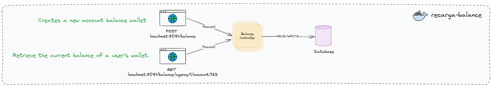
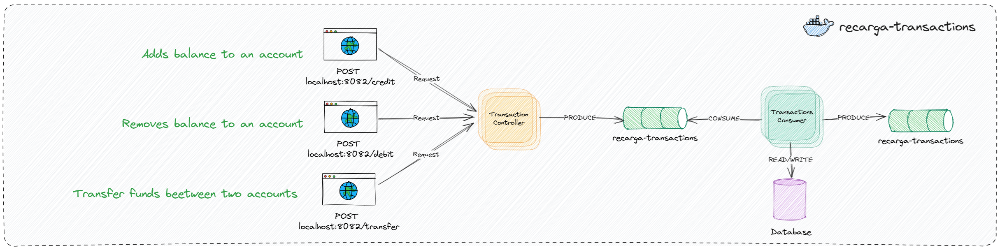
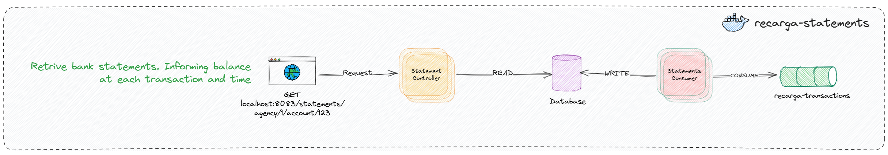

# Recarga Wallet

Welcome to RecargaWallet! The easiest banking solution to manage accounts. 

## _System Design Overview_


### Functional Requirements

- **Create Wallet:** Allow the creation of wallets for users. 
- **Retrieve Balance:** Retrieve the current balance of a user's wallet.
- **Retrieve Historical Balance:** Retrieve the balance of a user's wallet at a specific point in the past.
- **Deposit Funds:** Enable users to deposit money into their wallets.
- **Withdraw Funds:** Enable users to withdraw money from their wallets.
- **Transfer Funds:** Facilitate the transfer of money between user wallets.

### Audit

All transactions are stored in database. Furthermore, events are produced for each action: request, failed and created. It's possible to connect to Kafka Topics and track all the transactions ever done for each bank account.

### *Design decisions*

#### Asynchronous result

Communication between distributed systems can be very complex, even more if most of interactions are synchronous. Taking care about it, RecargaWallet sends the request results asynchronously. The benefits are various:

- Avoid sucessive requests blocking.
- Loosely coupling.
- Result storage by topic structure  

RecargaWallet provides API endpoints for clients made requests. 
Once a request is accepted by API, a result will be delivery by topic.

#### Microsservices

It's importante to guarantee that if a service became unvailable then others service will keep working without know about the unavailability of degraded service. So, RecargaWallet is composed by three independent, **_recarga-balance_**, **_recarga-transactions_** and **_recarga_statements_**.

- **_recarga-balance_**: Responsible to register new accounts and retrive its balance. All requests are made synchronous.

  

- **_recarga-transactions_**: Responsible to receive and process all the transactions requests, including credit, debit and transfer. For each request, a result is delivered asynchronously in "_recarga-transactions_" Kafka topic.

  

- **_recarga-statements_**: Responsible to consume succeeded transactions results from "_recarga-transactions_" kafka topic and provide bank statement timeline.  

  

## _How to install and run the service._

Follow the steps above to run RecargaWallet locally:

1. Clone this repository to any desired folder in your machine
    
2. Navigate to root directory

    ```console 
    $ cd RecargaWallet 
    ```

3. In root directory, start services with docker compose with command:

    ```console 
    $ sudo docker compose up -d --build
    ```
4. Now, all services are running.


## _Using the system_

- [Recarga Balance Documentation](./recarga-balance/README.MD)
- [Recarga Transactions Documentation](./recarga-transactions/README.MD)
- [Recarga Statements Documentation](./recarga-statements/README.MD) 


## Compromises and trade-offs made due to time constraints.

- Due to time contraint, if an exception occurs, them message will be losed. To avoid it, the retry-dlq could be implemented.
- Due to time contraint, tests were ommited. But, unit, integration and functional tests are always welcome.